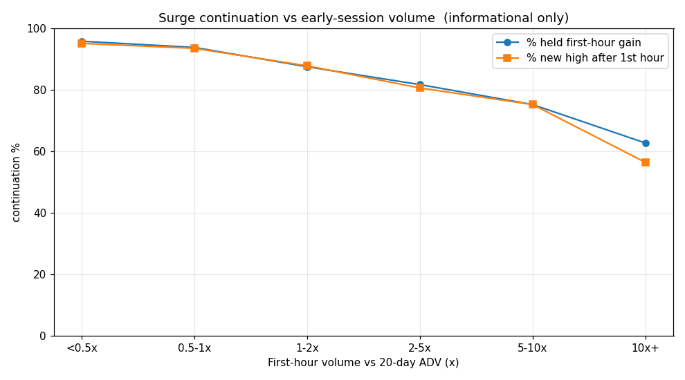

# Surge Volume -> Continuation Study

_Informational and educational only - not investment advice._

**Sample:** 2980 single-day surge events (>= 30% close-to-close) in small/micro-cap US stocks over ~2 years,
with intraday 30-min bars and point-in-time 20-day average daily volume (ADV).

## Question
Does heavier **early-session volume** (first hour, relative to the stock's normal ADV) predict the surge
**continuing up the same day** rather than fading?

## Result — continuation by first-hour volume (x ADV)
| early-vol (1st hr / ADV) | n | % up close | % held 1h gain | % new high after 1h | mean close-in-range | mean close vs open % |
|---|---|---|---|---|---|---|
| <0.5x | 1072 | 96.0 | 95.8 | 95.1 | 0.768 | 40.65 |
| 0.5-1x | 325 | 97.2 | 93.8 | 93.5 | 0.762 | 36.26 |
| 1-2x | 369 | 93.5 | 87.5 | 87.8 | 0.741 | 29.29 |
| 2-5x | 360 | 92.8 | 81.7 | 80.6 | 0.717 | 26.03 |
| 5-10x | 210 | 89.0 | 75.2 | 75.2 | 0.662 | 26.19 |
| 10x+ | 644 | 68.5 | 62.7 | 56.4 | 0.498 | 27.17 |

**Overall:** 89.0% closed above the open; 84.3% held their first-hour gain;
mean close-in-range 0.692 (0=low, 1=high). Correlation(first-hour vol x ADV, close-in-range) = -0.115.

## How to read it
"Held first-hour gain" and "new high after the first hour" are the continuation signals. If continuation %
rises with the early-volume multiple, that multiple is the "volume it takes to keep trending up" — the live
scanner can flag names crossing that threshold near the open.

## Red-team caveats (read before trusting this)
- **Survivorship:** the universe is *currently active* small/micro names, so surges from since-delisted tickers
  (many pump-and-dumps that faded) are missing. Real continuation rates are likely **lower** than shown.
- **No guarantee:** these are historical base rates, not promises. Regime, liquidity, and news dominate any
  single event.
- **Look-ahead:** ADV is trailing (pre-surge) and intraday is same-day, so the signal is usable at the open;
  but slippage/spread on micro names can erase edge. Verify tradeable liquidity per name.
- **Split artifacts:** a few "surges" may be raw-price split effects; these show no real intraday volume ramp.
